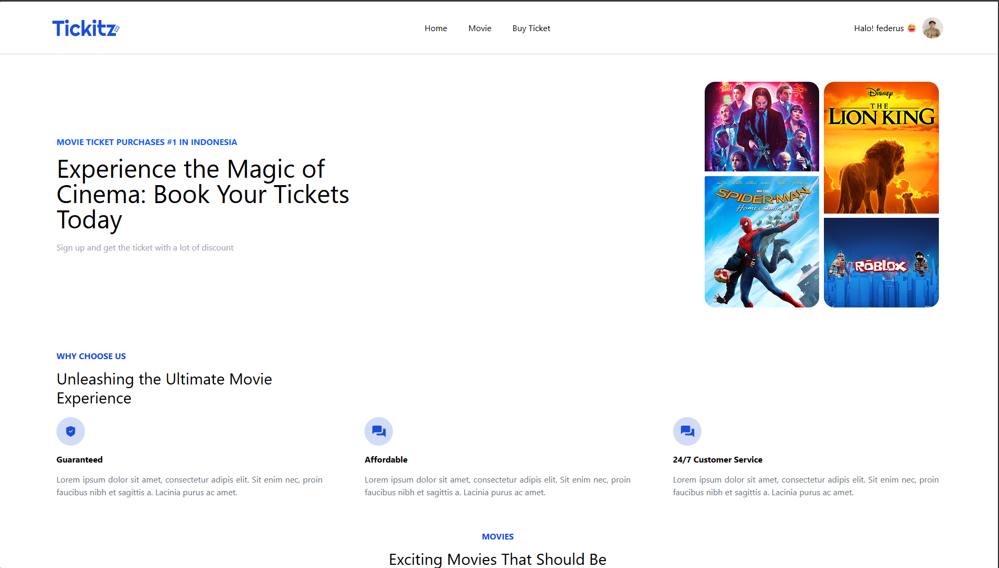

#  🚀 Tickitz – Vite & React

> A fast and modern frontend application built using **React 19**, **Vite**, **Tailwind CSS**, and **Redux Toolkit**. Designed for scalability, maintainability, and an excellent developer experience.

---

## 📸 Preview
🔐 Login Page


📊 Dashboard


## 🚀 Features
- ⚛️ **Modern React 19** – Component-based architecture
- ⚡ **Vite Dev Server** – Super-fast build  
- 🔀 **React Router v7** – Client-side routin
- 📦 **Redux Toolkit** – Simplified state management  
- 💾 **Redux Persist** – Persistent global state across sessions  
- 🧠 **Redux Thunk** – Middleware for handling async
- 📡 **Axios** – Seamless HTTP requests 
- 🌈 **Tailwind CSS** – customizable design system  
- 🔔 **Sonner** – Lightweight toast notifications for better UX  
- 🔁 **Reusable Components** – principles with modular and composable UI  Pages

## 🛠️ Tech Stack


##  🔐 .env Configuration
```
VITE_BE_HOST=http://localhost:8080
```
## 📦 How to Install & Run
First, clone this repository : 
https://github.com/federus1105/project_tickitz_react.git
```bash
cd project_tickitz_react
```
### Install Dependencies
```npm
npm i
```
### Run Project
```
npm run dev
```
### Open In Browser
```
http://localhost:5173/movies
```
## 👨‍💻 Made by
### 📬 fedeursrudi@gmail.com
